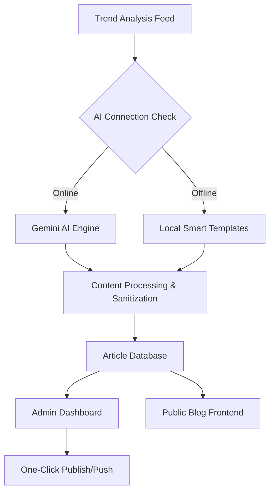

<div align="center">

# 🚀 AI Medium Engine
### *The Ultimate Autonomous Content Ecosystem & SaaS Solution*

[](https://github.com/omerabali/ai-medium-engine)
[](https://github.com/omerabali/ai-medium-engine)
[](https://github.com/omerabali/ai-medium-engine)
[](https://github.com/omerabali/ai-medium-engine)

**Autonomous Generation** • **Smart Fallback** • **Auto-Pushing** • **Ready Infrastructure**

---

[Key Features](#-core-pillars) • [System Architecture](#-system-architecture) • [Getting Started](#-quick-start) • [SaaS Model](#-saas--business-vision) • [Turkish Docs](#-tr-proje-hakkında)

</div>

---

## 🎯 Project Overview
**AI Medium Engine** is a production-grade content operations center designed for the modern web. In an era of information fatigue, consistency is the ultimate competitive advantage. This project solves the two biggest bottlenecks in content strategy: **Manual Content Fatigue** and **API Dependency Risks**.

By combining **Google Gemini 1.5 Flash** with a unique "Fail-Safe" local generation engine, we ensure your publishing pipeline remains online even during third-party API outages. It is designed to be deployed as a stand-alone SaaS or integrated into existing media companies.

---

## 🇹🇷 TR: Proje Hakkında
**AI Medium Engine**, yayıncılık dünyasını otonom bir yapıya taşıyan profesyonel bir SaaS çözümüdür. Sadece bir metin üreticisi değil, trend analizi yapan, makale yazan ve bunları "Sıfır Kesinti" güvencesiyle farklı platformlara pompalayabilen uçtan uca bir içerik operasyon merkezidir.

---

## 🏛️ Core Pillars

### 1. Autonomous Content Generation 🤖
The engine connects directly to live feeds (HackerNews, Dev.to) to identify trending technical topics. Using Gemini 1.5 Flash, it produces:
-   **Deep Dives**: Long-form technical analysis.
-   **Tutorials**: Step-by-step guides with code blocks.
-   **Listicles**: High-engagement "Top 10" style posts.
-   **Opinion Pieces**: Thought leadership content.

### 2. Zero-Downtime Fallback System 🛡️
Our proprietary **Fail-Safe** mechanism detects API errors in real-time. If the AI service is unreachable, the system automatically switches to its **Local Smart Templates**.
-   **Contextual Jargon**: Injects category-specific keywords (e.g., *Serverless, Kubernetes, Neural Networks*) into pre-built high-quality structures.
-   **SEO Preservation**: Maintains content flow and keyword density even in "Offline Mode."

### 3. Automated Content Pushing 🚀
The system isn't just a dashboard; it's a delivery engine.
-   **Direct Blog Integration**: Push generated content to your own hosted blog infrastructure in milliseconds.
-   **Ready-to-Use UI**: A premium React-based reader interface is included in the package.

### 4. SaaS Ready Architecture 💼
Designed with a monthly subscription model in mind:
-   **User Management**: Role-based access for creators and admins.
-   **Stats API**: Track views, published counts, and generation history.
-   **Multi-User DB**: Lightweight JSON persistence (expandable to SQL/NoSQL).

---

## 🏗️ System Architecture

### High-Level Data Flow


### Technology Stack Detail
| Layer | Technologies | Role |
| :--- | :--- | :--- |
| **Frontend** | React 18, Vite, Framer Motion | Dynamic admin dashboard & immersive reader UI. |
| **Styling** | Tailwind CSS, Lucide Icons | Responsive, premium aesthetics with glassmorphism. |
| **Backend** | Node.js, Express | Content orchestration, API routing, and AI integration. |
| **Persistence** | FileSystem (JSON) | Lightweight data storage with atomic write operations. |
| **Intelligence** | Gemini 1.5 Flash | Real-time article and topic generation. |
| **Monitoring** | Dotenv, FS-Extra | Environment management and file tracking. |

---

## ⚙️ Technical Deep Dive

### The Fallback Engine Logic
When a POST request hits `/api/articles/generate`, the server attempts to reach Google's Generative AI. If a `SyntaxError`, `NetworkError`, or `QuotaError` occurs:
1.  **Detection**: The `catch` block intercepts the error.
2.  **Activation**: `generateRichMockArticle()` is called.
3.  **Template Selection**: One of 6 distinct template types is chosen based on a random seed.
4.  **Keyword Injection**: Technical jargon relative to the selected category (Web Dev, AI, Cloud, etc.) is injected into the Markdown.
5.  **Seamless Delivery**: The user receives a valid article structure, oblivious to the API outage.

---

## 🛠️ Installation & Setup

### Prerequisites
- **Node.js**: Version 18.x or higher as required.
- **Git**: To clone the repository.
- **Gemini API Key**: From Google AI Studio.

### Step 1: Clone the Repository
```bash
git clone https://github.com/omerabali/ai-medium-engine.git
cd ai-medium-engine
```

### Step 2: Backend Setup
```bash
cd backend
npm install
```

### Step 3: Configure Environment
Create a `.env` file in the `backend` folder:
```bash
PORT=3000
GEMINI_API_KEY=your_google_ai_studio_key_here
```

### Step 4: Frontend Setup
```bash
cd ../frontend
npm install
```

### Step 5: Launch
```bash
# In one terminal (Backend)
cd backend
npm start

# In another terminal (Frontend)
cd frontend
npm run dev
```

---

## 📊 API Reference (Backend)

| Endpoint | Method | Description |
| :--- | :--- | :--- |
| `/api/categories` | GET | List all available content categories with icons and colors. |
| `/api/trending` | GET | Fetch live technical trends from external feeds. |
| `/api/articles/:userId` | GET | Get all articles (drafts + published) for a specific user ID. |
| `/api/articles/generate` | POST | The core engine. Generates content using AI or Fallback. |
| `/api/articles/publish/:id`| POST | Updates status to 'published' and simulates external pushing. |
| `/api/admin/stats` | GET | Returns global stats for the dashboard overview. |

---

## 🖥️ Dashboard Features
1.  **Live Trends Grid**: Real-time cards showing what's hot on HackerNews.
2.  **Category Selector**: Tailwind-styled pills to steer the AI's creative direction.
3.  **Language Toggle**: Switch between **Turkish** and **English** for the entire platform.
4.  **Immersive Reader**: Full-screen, distraction-free reading mode with progress bars.
5.  **CRUD Operations**: Edit, delete, and manage your library with ease.

---

## 💼 SaaS & Business Vision
This project is built to handle multiple monetization strategies:
-   **B2B Content Engine**: Sell automated content pipelines to tech companies.
-   **Niche News Portals**: Launch automated technical news sites in specialized fields.
-   **Direct Sale Platform**: License the engine as a white-label solution for media agencies.
-   **Subscription Dashboard**: Charge creators a monthly fee for access to the generation tokens.

---

## 🗺️ Engineering Roadmap

| Phase | Milestone | Status |
| :--- | :--- | :--- |
| **V1.0** | Core AI Generation & Fallback System | ✅ Completed |
| **V1.1** | Immersive Dashboard & TR/EN Localization | ✅ Completed |
| **V1.2** | Automated Pushing to WordPress/Medium API | 🔄 In Progress |
| **V2.0** | Mobile Operations (iOS/Android via Capacitor) | 📅 Planned |
| **V2.1** | Advanced NLP Fine-tuning for specific tones | 📅 Planned |

---

## 🤝 Contributing
Contributions are what make the open-source community such an amazing place to learn, inspire, and create.
1.  Fork the Project.
2.  Create your Feature Branch (`git checkout -b feature/AmazingFeature`).
3.  Commit your Changes (`git commit -m 'Add some AmazingFeature'`).
4.  Push to the Branch (`git push origin feature/AmazingFeature`).
5.  Open a Pull Request.

---

## ✍️ Author & License

**Ömer Abalı**
*Senior Software Engineer & Passionate Tech Lead*

- [LinkedIn](https://www.linkedin.com/in/omerabali/)
- [GitHub](https://github.com/omerabali)

Distributed under the **MIT License**. See `LICENSE` for more information.

---

<div align="center">
  <h3>If AI Medium Engine helped you, consider giving it a ⭐!</h3>
  <p>Building the future of automated publishing, one article at a time.</p>
</div>


