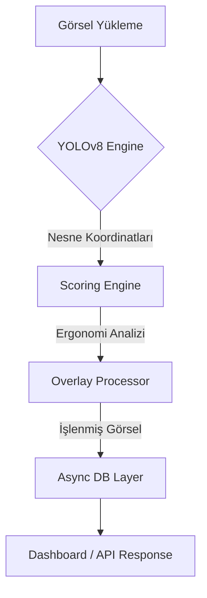

<div align="center">
  
  <br>
  <h1>🖥️ DeskAI: Masa Ergonomi ve Düzen Analiz Sistemi</h1>
  <p><strong>YOLOv8 ve FastAPI tabanlı, otonom masa düzeni ve ergonomi değerlendirme ekosistemi.</strong></p>

  <p>
    
    
    
    
  </p>
  
  <p align="center">
    <i>"Verimlilik, masanızdaki nesnelerin koordinatlarıyla başlar."</i>
  </p>
</div>

<br>

<div align="center">
  <h2>🎯 Proje Vizyonu</h2>
</div>

**DeskAI**, modern çalışma alanlarının ergonomik standartlara uygunluğunu ve düzen kalitesini otonom olarak analiz eden üst düzey bir mühendislik çözümüdür. Proje, sadece nesneleri tanımakla kalmaz; nesnelerin birbirine göre konumlarını, masadaki kalabalık oranını ve potansiyel güvenlik risklerini (sıvı teması vb.) hesaplayan gelişmiş bir puanlama motoruna sahiptir.

<br>

<div align="center">
  <h2>🧠 Çekirdek Yetenekler</h2>
</div>

*   **Otonom Nesne Algılama**: YOLOv8 mimarisi ile monitör, klavye, fare ve yan ürünlerin gerçek zamanlı tespiti.
*   **Hezarfen Puanlama Motoru**: Kural tabanlı ergonomi algoritmaları ile düzen skorunun (0-100) hesaplanması.
*   **Görsel Overlay Sistemi**: Analiz edilen görseller üzerinde sınırlayıcı kutuların ve skorların otomatik işlenmesi.
*   **Asenkron Performans**: FastAPI ve SQLAlchemy ile kesintisiz veri akışı.

---

<div align="center">
  <h2>🏛️ Sistem Mimarisi</h2>
</div>

<br>



<br>

<div align="center">
  <h3>🛠️ Teknoloji Yığıtı</h3>
</div>

| Katman | Teknoloji | Görev |
| :--- | :--- | :--- |
| **Backend** | Python / FastAPI | Asenkron API yönetimi |
| **AI/ML** | YOLOv8 (Ultralytics) | Nesne algılama |
| **Veritabanı** | SQLAlchemy / SQLite | Veri persistency |
| **Görüntü İşleme** | Pillow / NumPy | Overlay üretimi |

---

<div align="center">
  <h2>🚀 Hızlı Başlangıç</h2>
</div>

1.  **Bağımlılıkları Kurun:**
    ```bash
    pip install -r requirements.txt
    ```

2.  **Modelleri Hazırlayın:**
    `models/` dizinine `.pt` ağırlıklarını ekleyin.

3.  **Sunucuyu Çalıştırın:**
    ```bash
    uvicorn app.main:app --reload
    ```

<br>

<div align="center">
  <h2>📊 API Referansı</h2>
</div>

| Endpoint | Metot | Açıklama |
| :--- | :--- | :--- |
| `/upload` | POST | Masa fotoğrafı analizi |
| `/history` | GET | Geçmiş sonuçlar |
| `/admin/train` | POST | Model tetikleyici |

<br>

---

<div align="center">
  <p>Bu proje <b>MIT Lisansı</b> altında sunulmaktadır.</p>
  <p><i>Masanızdaki her milimetre, verimliliğinizin bir parçasıdır. 🚀</i></p>
</div>

<br>

<div align="center">
  <a href="https://www.linkedin.com/in/omerabali" target="_blank">
    
  </a>
</div>
