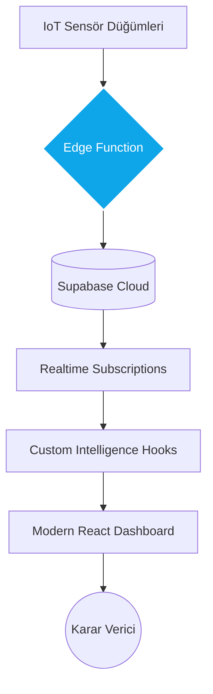

<div align="center">
  

  # <span style="font-family: 'JetBrains Mono', monospace; font-weight: 800; letter-spacing: -1px; color: #0ea5e9;">T E R R A W A T C H</span>
  ### <span style="color: #64748b; font-weight: 400;">Global Agriculture Intelligence • Signal Analysis • Strategic IoT Engine</span>

  **Kesintisiz Veri Akışı** • **Otonom Sensör Analizi** • **Prediktif Karar Destek**

  [🌐 Canlı Demo](https://terrawatch-demo.com) • [📖 Dokümantasyon](#) • [💬 LinkedIn](https://www.linkedin.com/in/omerabali)

  
  
  
  
  

  <br/>
  <p align="center">
    <b>"Gürültüden Sinyali Ayıklayın."</b><br/>
    Konvansiyonel tarım verilerini fütüristik bir istihbarat merkezine dönüştüren, yüksek performanslı sinyal analiz platformu.
  </p>
</div>

---

## 🎯 TerraWatch Nedir? (The Vision)

**TerraWatch**, modern tarım çağının en temel paradoksu olan "bilgi asimetrisi" ve "verim kaybını" çözmek amacıyla tasarlanmış, uçtan uca otonom bir tarımsal istihbarat ekosistemidir. Basit bir sensör izleyiciden öte; veriyi otonom olarak işleyen, önceliklendiren ve kullanıcıya stratejik bir "görüş netliği" sunan bir karar destek mekanizmasıdır.

### Temel Değer Önerileri (Core Value Props)

1.  **Autonomous IoT Pipeline**: 7/24 kesintisiz veri madenciliği yapan, ESP32 ve Raspberry Pi düğümlerinden gelen sinyalleri normalize eden merkezi motor.
2.  **Intelligence & Analysis**: Verileri sadece listelemez; anlık durum analizi ile (Kritik/Uyarı/Normal) kategorize eder ve meta-veriler ekler.
3.  **Real-time Visualization**: PostgreSQL Realtime altyapısını kullanarak sensör değişimlerini milisaniyeler içinde arayüze yansıtır.
4.  **Offline-First Infrastructure**: İnternet bağlantısı kesildiğinde dahi kesintisiz erişim sağlayan LocalStorage tabanlı persistency katmanı.

---

## 🏗️ Mimari ve Teknik Altyapı (Architecture & Tech Stack)

TerraWatch, yüksek ölçeklenebilir ve modüler bir mikro-mimari üzerine inşa edilmiştir.

### Teknik Katmanlar
- **Data Orchestration layer**: TanStack Query (v5) kullanılarak asenkron veri akışı, global önbellek yönetimi ve iyimser güncellemeler (optimistic updates) optimize edilmiştir.
- **Embedded Layer**: ESP32 Firmware ve Python Client scriptleri ile saha verilerinin güvenli iletimi.
- **Identity & Security**: Supabase Auth tabanlı, JWT bazlı yetkilendirme ve veritabanı seviyesinde Row Level Security (RLS) politikaları.



---

## 🚀 Gelişmiş Özellikler (Advanced Features)

### 🧠 Akıllı Eşik Yönetimi
Sistem, belirlenen sınır değerlerine göre otonom kararlar verir:
- **Dinamik Skorlama:** Toprak nemi ve sıcaklık oranlarına göre bitki sağlığı skorlanır.
- **Prediktif Bildirimler:** Don riski veya aşırı kuruma gibi durumlar gerçekleşmeden önce uyarı sinyalleri üretilir.

### ⚡ Kesintisiz Veri ve Offline Desteği
- **Auto-Sync:** Belirlenen interval aralıklarıyla durmaksızın veri yenileme.
- **Offline Persistence:** `useOfflineData` ile verilerin yerel depolanması ve bağlantı durumuna göre dinamik toast bildirimleri.

### 📊 Veri İndirme ve Raporlama
- **Advanced Export:** Son 7 veya 30 günlük verileri analiz için tek tıkla CSV formatında dışa aktarma.
- **Trend Analizi:** Recharts tabanlı dinamik grafikler ile uzun vadeli değişim takibi.

---

## 🛠️ Teknik Envanter (Inventory)

| Bileşen | Teknoloji | Mimari Karar Nedeni |
|:---|:---|:---|
| **Platform** | React 18 + Vite | Modern, tree-shaking destekli ve hızlı altyapı. |
| **Mobile** | Capacitor | Hibrit mobil uygulama desteği ile her yerden erişim. |
| **Logic** | Custom TypeScript Hooks | İş mantığının arayüzden soyutlanması. |
| **Backend** | Supabase (Postgres) | Real-time yetenekler ve dahili Auth desteği. |
| **Styling** | Shadcn UI + Tailwind | Erişilebilirlik standartlarına uygun UI. |

---

## ⚙️ Kurulum ve Geliştirme (Setup)

```bash
# 1. Projeyi Klonlayın
git clone https://github.com/omerabali/terrawatch.git

# 2. Bağımlılıkları Yükleyin
npm install

# 3. Ortam Değişkenlerini Tanımlayın (.env)
VITE_SUPABASE_URL=your_url
VITE_SUPABASE_ANON_KEY=your_key

# 4. Geliştirici Sunucusunu Başlatın
npm run dev
```

---

## 👤 Geliştirici (Author)

**Ömer Abalı**

Yapay zeka odaklı uygulamalar, IoT veri hatları ve modern web mimarileri üzerine uzmanlaşmış bir geliştirici.

- 💼 LinkedIn: [linkedin.com/in/omerabali](https://linkedin.com/in/omerabali)
- 🖥️ GitHub: [github.com/omerabali](https://github.com/omerabali)

---

<div align="center">
  <br/>
  <a href="https://www.linkedin.com/in/omerabali" target="_blank">
    
  </a>
  <br/><br/>
  <strong>TERRAWATCH | Her Şeyi Gör. Sinyali Yakala.</strong><br/>
  <br/>
  Made with ❤️ for high-performance agricultural mapping.
</div>


