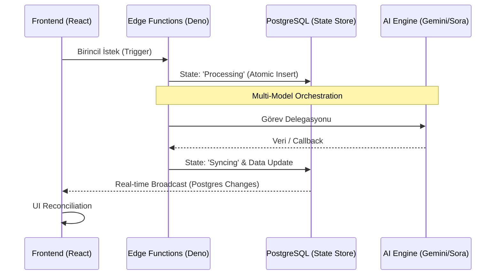

# 🎥 InfluencerAI Studio: Scalable Synthetic Content Systems

[](https://vitejs.dev/)
[](https://reactjs.org/)
[](https://supabase.com/)
[](https://deno.land/)

> [!WARNING]
> **API Kullanımı Hakkında Önemli Bilgilendirme**
> OpenAI Sora ve Gemini modellerinin mevcut API kotalarının dolması sebebiyle (limit aşımı / süre dolumu), proje şu anda canlı AI video üretimi yapamayabilir. Sistemi kendi ortamınızda çalıştırmak isterseniz:
> - **Video Üretimi:** Kaynak koddaki API konfigürasyonlarını (API Key ve Endpoint) değiştirerek **Google Veo 3**, **Kling 2.6** gibi alternatif açık ve erişilebilir video üretim modellerini sisteme kolayca entegre edebilirsiniz.
> - **Senaryo Üretimi:** Projedeki text-to-text / analiz işlemleri için kendi **Gemini API** anahtarınızı (.env dosyasında) güncelleyerek sorunsuz bir şekilde kullanıma devam edebilirsiniz.

**InfluencerAI Studio**, modern generative AI (GenAI) yeteneklerini endüstriyel ölçekte bir içerik fabrikasına dönüştüren bir **System Orchestration Engine**'dir. Bu platform, karmaşık asenkron iş akışlarını, multi-model yapay zeka entegrasyonlarını ve yüksek hacimli veri izolasyonunu tek bir hatasız mimaride birleştirir.

---

## 🏛️ Sistem Tasarım Felsefesi (Architecture)

Bu sistem, **Event-Driven Architecture (EDA)** ve **Stateless Execution** prensipleri üzerine inşa edilmiştir.

### 🧩 Tasarım Desenleri ve Yaklaşımlar
- **Chain of Responsibility**: Senaryo üretimi, birbirini takip eden bağımsız AI ajanları (Strategy -> Character -> Prompt) tarafından gerçekleştirilir.
- **Optimistic UI Updates**: Uzun süren asenkron işlemler sırasında kullanıcı deneyimini maksimize etmek için React Query ile optimistic update ve real-time feedback mekanizmaları kullanılır.
- **BaaS (Backend-as-a-Service) Leveraging**: Supabase'in sunduğu native yetenekler (Auth, RLS, Storage), "Infrastructure-as-Code" mantığıyla ölçeklenebilir bir temel sağlar.

### 🔄 Asenkron İş Akışı ve Durum Yönetimi



---

## 📊 Veri Mimarisi ve Güvenlik (Security-in-Depth)

Sistem, "Zero Trust" ve "Data Isolation" prensiplerini veritabanı seviyesinde uygular.

- **PostgreSQL RLS (Row Level Security)**: Uygulama katmanındaki olası sızmalara karşı, veriye erişim yetkisi doğrudan veritabanı motoru tarafından (JWT tabanlı) kontrol edilir.
- **Secure Secret Management**: AI API anahtarları ve servis rol anahtarları asla istemci tarafına sızdırılmaz; tüm hassas operasyonlar `secret-only` ortamında çalışan Edge Function'larda encapsulate edilmiştir.
- **Input Validation & Sanitization**: Tüm kullanıcı girdileri, Zod şemaları ile hem frontend hem de backend katmanlarında strictly valide edilir.

---

## � Gözlemlenebilirlik ve Mukavemet (Observability & Resilience)

Profesyonel bir sistem, hataları bekler ve onları yönetir.

- **Fault Tolerance**: Deno Edge Runtime üzerinde çalışan hata yakalama (Error Catching) mekanizmaları, AI servislerindeki kesintileri kullanıcıya "Graceful Degradation" (anlamlı hata mesajları) olarak yansıtır.
- **Exponential Backoff**: Sora ve Gemini API çağrılarında limit aşımlarına karşı logaritmik bekleme ve tekrar deneme (Retry) stratejileri uygulanır.
- **Logging & Tracing**: Tüm kritik işlemler (Video request, Payment logs) Supabase Logs üzerinden merkezi olarak takip edilebilir ve audit edilebilir.

---

## 🛠️ Teknik Kurulum ve DX (Developer Experience)

### Modüler Klasör Yapısı
```text
├── supabase/
│   ├── functions/        # Stateless business logic
│   └── migrations/       # Version-controlled schema evolution
├── src/
│   ├── components/       # Reactive & Stateless UI units
│   ├── hooks/            # Custom reusable logic (Abstraction Layer)
│   └── lib/              # Core utility & config singletons
└── README.md
```

### Hızlı Başlangıç
1.  **Environment Sync**: `.env` dosyasını yapılandırın.
2.  **Edge Functions**: `supabase functions deploy` ile logic katmanını dağıtın.
3.  **Client**: `npm run dev` ile reaktif arayüzü başlatın.

---

## 📈 Stratejik Yol Haritası (Scalability)

- **Worker Node Scaling**: Video rendering yükünü daha fazla Edge Function veya specialized worker'lara dağıtarak paralel kapasiteyi artırma.
- **Edge Caching**: Sık üretilen benzer içerikler için CDN tabanlı caching stratejileri.
- **Observability Dashboard**: Gelişmiş metrik takibi için özel dashboard entegrasyonu.

---

## 📄 Lisans
Bu proje, yazılım mühendisliği disiplini ve inovasyon odaklı bir vizyonla **MIT Lisansı** altında sunulmuştur.

---
*Architectural Excellence by InfluencerAI Studio Engineering.*
